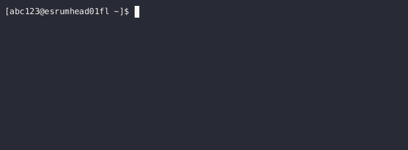

.. _p_tips_tmux:

###############################
 Persistent sessions with tmux
###############################

This section describes how to use tmux_ to manage multiple sets of
terminals, to name your terminals to remind yourself what you were
working with, and to leave your terminals running in the background when
you disconnect from the server (whether intentionally or
unintentionally).

Using tmux_ is therefore highly recommended when you are working on the
cluster, since it lets you work uninterrupted over multiple days,
without having to leave your computer running at all time and without
having to worry about your internet connection staying up. Anyone
already using GNU screen_ or one of the other alternatives can of course
keep using those.

The following gives brief introduction to using tmux_. A more detailed
`getting started`_ guide can be found in the official tmux_
documentation.

*****************
 Getting started
*****************

To get started, ``cd`` to the directory you wish to work in and run
``tmux`` or the longer (but equivalent) command ``tmux new``:

.. code::

   $ cd /projects/my_project/people/abc123
   $ tmux

This will start tmux and create a new session (group of terminals) with
a single window (terminal) to begin with, and will make new terminal
start with the current working directory set to
``/projects/my_project/people/abc123``. The benefit of changing your
working directory before starting tmux is that all terminals opened in
that session will start in that directory.

Creating and navigating between terminals
=========================================

You start your new session with a single, blank terminal, but you can
create any number of additional terminals using the ``Ctrl+b c``
keyboard shortcut. To use this shortcut first press ``Ctrl+b``, then
release the buttons and press ``c`` and *only* ``c``. Notice how each
terminal gets listed on the tmux bar.

..
   TODO: Screenshot

When you have more than one terminal in a session, you can switch
between them using ``Ctrl+b n`` to switch to the next terminal and
``Ctrl+b p`` to switch to the previous terminal.

..
   TODO: Screenshot

To close the terminals you've created, use either the ``exit`` command
or press ``CTRL+d`` while on an empty line:

.. code::

   ### either
   $ exit
   ### or
   $ <press CTRL+d>

tmux_ will exit with the message ``[exited]`` once the last terminal in
the current session has been closed.

..
   TODO: Screenshot

Detaching from and re-attaching to your sessions
================================================

Instead of existing your terminal, tmux gives you the option of
"detaching" from the session. This leaves everything running on the
server until you re-attach to the session. You will typically detach
once your jobs are running or simply if you need to leave for the day.

To disconnect from the current session, use the keyboard shortcut
``CTRL+b d``. This returns you to your regular terminal and you can
safely disconnect from the server:

..
   TODO: Screenshot

Once you wish to resume your work, you can use the ``tmux attach``
(command to re-open your running sessions, optionally specifying the
name of the session you wish to open (see also below):

.. code::

   ### either
   $ tmux attach
   ### or
   $ tmux attach -t project

Alternatively, you can use the keyboard shortcut ``CTRL+b s`` to switch
to the correct session after you've attached tmux.

..
   TODO: Screenshot

Naming your sessions and windows
================================

tmux allows you to give custom names to each session (group of
terminals) and each window (terminal), in order to help you
differentiate between them. This is not required, but is is recommended
to do so if you work on multiple things at once.

When starting a new session with the command ``tmux new``, you can also
give the session a name with ``-s`` and the window can be given a name
with ``-n`` as follows. However, this can only if you are not already in
an active tmux session:

.. code::

   $ tmux new -s project -n task

.. image:: images/tmux_new_named.gif
   :class: gif

To rename an existing tmux session or window, you instead need to use
the `basic shortcuts`_ described below.

*****************
 Basic shortcuts
*****************

The following lists the basic shortcuts that you need to work with tmux.
Additional shortcuts can be found in the tmux `manual page`_ (``man
tmux``).

Every shortcut listed below is performed by first pressing ``CTRL+b``,
releasing those keys, and *then* pressing the specified button and
*only* the specified button.

**Creating new terminals in a session**

   -  ``CTRL+b c`` Creates a new terminal in the current session.

**Switching between sessions and windows**

   -  ``CTRL+b n`` Switches to the next window (terminal)
   -  ``CTRL+b p`` Switches to the previous window (terminal)
   -  ``CTRL+b s`` Switches to a different session (group of terminals)

**Renaming sessions and windows**

   -  ``CTRL+b ,`` Renames the current window (terminal)
   -  ``CTRL+b $`` Renames the current session (group of terminals)

**Detaching from tmux**

   -  ``CTRL+b d`` Detaches from the current session (group of
      terminals). Tmux keeps running after this along with your
      terminals.

**Scrolling in a tmux window**

   -  ``CTRL+b PageUp`` Enables scrolling with PageUp/PageDown and arrow
      keys. Press ESC to exit scrolling mode. Current line-number is
      indicated in yellow in the top right corner.

**********************
 Additional resources
**********************

.. _getting started: https://github.com/tmux/tmux/wiki/Getting-Started

.. _manual page: https://man.openbsd.org/OpenBSD-current/man1/tmux.1#DEFAULT_KEY_BINDINGS

.. _screen: https://www.gnu.org/software/screen/

.. _tmux: https://github.com/tmux/tmux/wiki
